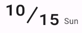

flutter_date_time_label
-----

Flutter package for displaying date/datetime label.

### DateLabel001


```dart
DateLabel001(
  dateTime: DateTime.now(),
  showYear: true,
);
```

### DateLabel002



```dart
DateLabel002(
  dateTime: DateTime.now(),
  showWeekday: true,
);
```
